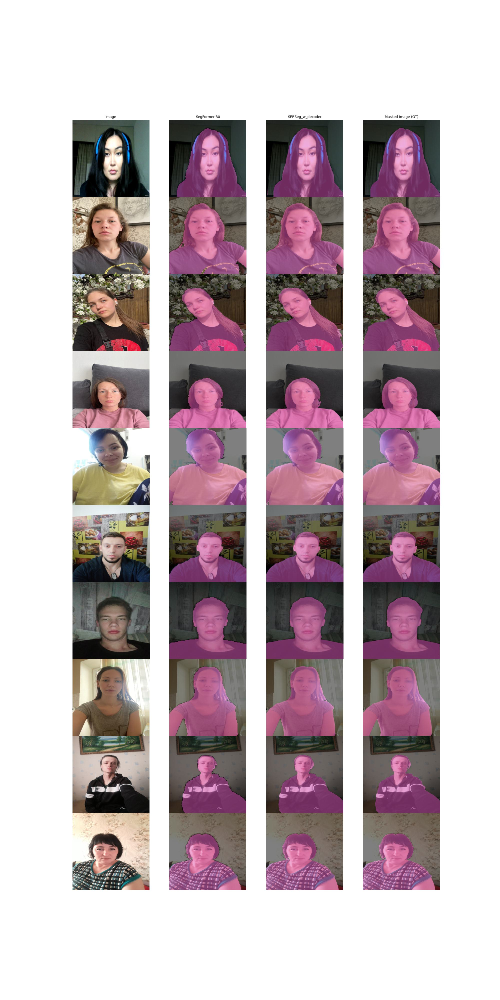

# Repository for fast person vs. background sem segmentation networks

# Repo structure

```
│
├── models/
│ └── SERSegFormer/
│ │ ├── config.py
│ │ ├── infer.py
│ │ └── model.py
│ ├── SERNet_Former/
│ │ ├── decoder.py
│ │ ├── encoder.py
│ │ ├── infer.py
│ │ └── model.py
│ └── SegFormer/
│ │ ├── config.py
│ │ ├── infer.py
│ │ └── model.py
│
├── modules/
│ ├── abg.py # Attention boosting Gate (from SERNet-Former)
│ ├── afn.py # Attention fusion Network (from SERNet-Former)
│ ├── dbn.py # Dilation based Network (from SERNet-Former)
│ ├── dam.py # Dual Attention Mechanism (from HSNet)
│ └── upsample.py # Nothing interesting here, just upsampling block of bilinear interpolation + Conv2d 
│
├── scripts/
│ ├── deploy.py # PyTorch -> ONNX -> CoreML
│ ├── train_segformer.py # script for vanilla Segformer-B0 training
│ ├── train_sernet.py # script for vanilla SERNet training
│ ├── train_serseg.py # SERSeg
│ ├── train_serseg_decoder.py # Segformer-B0 with convolutional decoder
│ └── train_serseg_w_depth.py # Segformer-B0 with AbG, DBN, and Depth Map
│
├── utils/
│ ├── losses.py
│ ├── initialization.py
│ ├── metrics.py
│ ├── trainer.py
│ ├── visualization.py
│ └── pipeline.py # Basic Segmentation pipeline class
│
├── data/
│ ├── easyportrait/(.gitignored)
│ │ └── images/
│ │ └── annotations/
│ ├── transforms.py
│ └── dataset.py
│
├── checkpoints/ (.gitignored)
│ └── <checkpoint_files>
│
│
├── Visualization.ipynb # Data visualization notebook for inner purposes (nothing interesting)
├── requirements.txt
└── README.md
```

# Inference

# Implemented models, modules, and features

## Models
- [x]  [SERNet-Former](https://arxiv.org/abs/2401.15741)
- [x]  [SegFormer](https://arxiv.org/abs/2105.15203)
- [x] SERSeg-Former (my model, which is a soup of latest sem seg and attention best practices on top of SegFormer-B0 backbone)  
- [x]  some additional modules like Dual Attention Mechanism from [HSNet](https://ieeexplore.ieee.org/document/10495017) as a bonus

## Modules

- [x] Attention-Boosting Gate (AbG, [https://arxiv.org/abs/2401.15741](https://arxiv.org/abs/2401.15741)) 
- [x] Attention fusion Network (AfN, [https://arxiv.org/abs/2401.15741](https://arxiv.org/abs/2401.15741))
- [x] Dual Attention Mechanism (DAM, [https://arxiv.org/abs/2401.15741](https://arxiv.org/abs/2401.15741))
- [x] Dilation Based Network (DbN, [https://ieeexplore.ieee.org/document/10495017
](https://ieeexplore.ieee.org/document/10495017)

## Features
- [x] CRF loss
- [x] DICE loss
- [x] SegFormer convolution decoder
- [x] Depth map
_
Note: all the features and modules are optional. It means you can manually enable or disable them in your personal configureation_

# Installation

```
pip install -r requirements.txt
```
_Note: Some extra dependencies may be included to the requirements.txt, which is a dummy snapshot of my working environment_

# Conducted experiments and TODOs

## SegFormer
- [x]  Number of SegFormer-B0 parameters is reduced from 15M to 3.7M without significant quality decrease
- [x]  Replace Segformer's upsampling interpolation with convolutional Upsampling block

## SERNet

- [x]  Experiments with SERNet’s backbone ([SegFormer-B0](https://github.com/open-mmlab/mmsegmentation/blob/v0.17.0/mmseg/models/backbones/mit.py#L246) w. [weights](https://n-ws-620xz-pd11.s3pd11.sbercloud.ru/b-ws-620xz-pd11-jux/easyportrait/experiments/models/segformer-ps-512.pth))
- [x]  AbG now incorporates feature (channel) attention only, not any spatial (like ViT patches) attention ([SegFormer-B0](https://github.com/open-mmlab/mmsegmentation/blob/v0.17.0/mmseg/models/backbones/mit.py#L246) w. [weights](https://n-ws-620xz-pd11.s3pd11.sbercloud.ru/b-ws-620xz-pd11-jux/easyportrait/experiments/models/segformer-ps-512.pth))
- [x]  Add learning-free [CRF](https://github.com/mishgon/crfseg/tree/master/crfseg) (Conditional Random Fields) layer to make the segmentation mask locally-consistent and smooth. The layer is learning-free and good even for the final mask post-processing. Easiest and chiepest way to gain some extra IoU, but may significantly slow down the inference. We can also add CRF to the training stage (say, to auxiliary heads and losses of the HSNet), if CRF significantly slows down the inference. *Note: takes 22ms on 512x512, so CRF loss only makes sense here. UPD: tested on SegFormer. Boost 0.1% (0.9795 →0.9796 IoU), does not worth it*
- [x]  Add channel compression and HSNet’s DAM to SERNet’s DbN *Note:*
- [x]  Add depth-maps as a separate channel (like in RGB-D) (https://pytorch.org/hub/intelisl_midas_v2/) (Adds 12ms to inference time, but may drastically increase the quality)
- [ ]  Add critic loss (CE and Dice loss values do not always reflect small segmentation artifacts, especially specific for the people vs. background segmentation problem)
- [x]  Add cross-attention to SERNet AfN’s AbGs with encoder feature maps (perform the skip-connection BEFORE AfN)
- [x]  Additional methods that are not applied during the SERNet-Former experiments, such as multiscale (MS) crop sizes of images as well as additional coarse datasets that most literature applies, can also improve the results of our network.Add cross-attention to SERNet AfN’s AbGs with encoder feature maps (perform the skip-connection BEFORE AfN)
- [x]  According to the authors discussion, the decoder part of SERNet-Former can also still be modified with AfNs.

# Results
All experiments are conducted on single 1080Ti (on raw PyTorch with no TensorRT and ONNX speedup) on 512x512 RBG images

IMPORTANT NOTE: the inference time can be easily reduced by ~2 times by moving from dynamic PyTorch Graphs to the static TensorRT ones. Unfortunately, my old 1080Ti became not compatible with latest TensorRT, so this research section left out of scope.

| Model | Inference time (ms)  | IoU | N_params (M) | Model size (Mb) |
| --- | --- | --- | --- | --- |
| SERNet-Former (EfficientNet) | 33 | 97.5 (Needs more training, I believe in that shit) | 9.2 | 35 |
| SegFormer-B0 | 13 | 98.0 | 3.7 | 14 |
| SERSeg | 16 + 12ms for Depth Prediction (MiDaS v2) | ? (Needs way more training time) | ~4.5 | 15 |
| SERSegFormer w DConv decoder | ~24 | 98.3 | 3.9 | 15 |
| SERSegFormer w DConv decoder, AbG, DBN, DAM | ~28 | ? | 4.2 | 15 |
| SERSegFormer w DConv decoder, AbG, DBN, DAM, and Depth channel | ~28 | ? | 4.2 | 15 |



# Checkpoints
* **SegFormer-B0** - [GDrive](https://drive.google.com/file/d/1s3ZUBs3oNUtyz77IZSe4tU4WqBcJhWy-/view?usp=sharing)

* **SERSegFormer-B0 w DConv decoder** - [GDrive](https://drive.google.com/file/d/1D1SnIW5krjDGlLuaulKpLZR9O6-y3ilS/view?usp=sharing) [Huggingface](https://huggingface.co/Leensman/serseg_b0_easyportrait/tree/main)

# Conclusion
Almost all the planned tasks were implemented, but since most of the planned experiments require training the model from scratch (with no transfer learning), there is a lack of expected results.

However, the repository itself provides a solid ground for vast further experiments, and provides usefull building blocks to apply the best attention practices in real time.

An ultra-lighweight version of the SegFormer-B0 is another key contribution of the repository. It is a fine-tuned version of the official CityScapes SegFormer-B0 model, and provised IoU 98.0 at 13ms (with ONNX+TensorRT, it can take even 6ms) and takes 14Mb. Really impressive!. It is a great baseline candidate for further experiments.

Also, based on the visual results, the dataset itself requires some cleaning. I am sure the current data quality interferers the models to reveal their potential completely.
